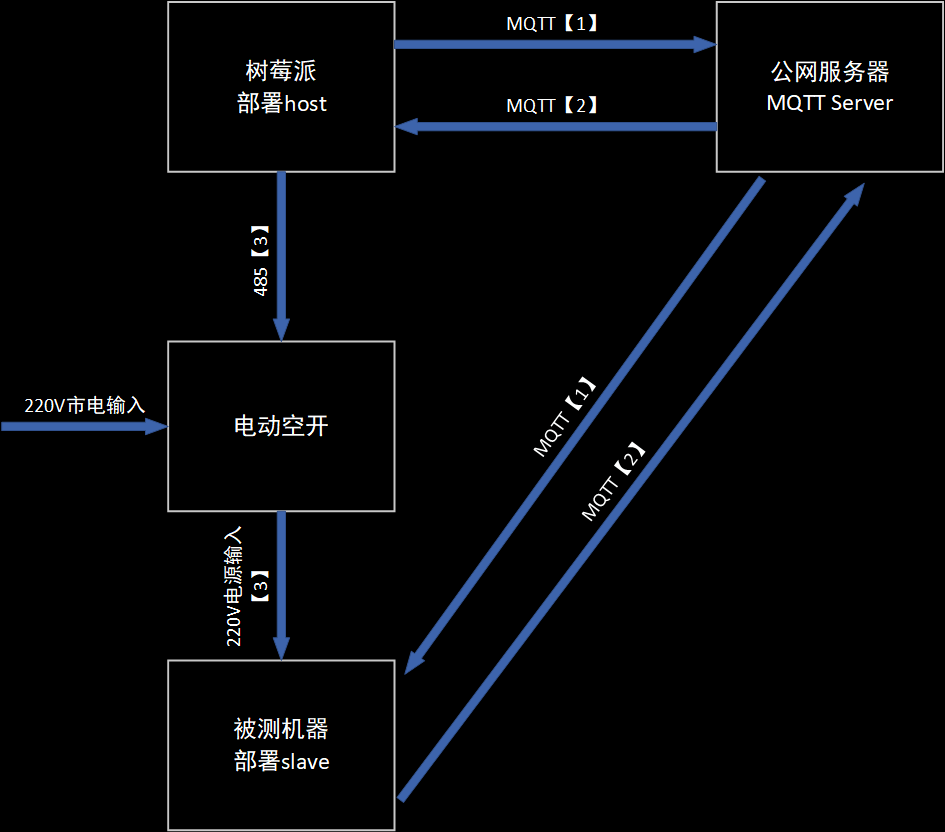

# pc_test_tools

网络稳定性测试工具

### 使用方法:
```
host部署在本地服务器上面

slave部署在被测试PC上面
```
### 测试原理:

```
host部署在本地服务器上面，通过MQTT发送指定消息到slave端【1】。slave端收到数据后回复host端【2】。host端进行发包收包计数，并进行统计和打印。
host端还通过485接口连接着一个电动空开，当host脚本开始运行后根据程序中的配置，每半小时关闭一次空开模拟意外断电【3】，2分钟后恢复供电，再2分钟后继续发送消息到slave端。
当host端连续收不到100个包的时候，空开保持打开，保持异常系统的状态。
```
### 部署方法:
```
被测机:
    sudo ./install.sh
    systemctl start network_stability_test-slave.service
    systemctl enable network_stability_test-slave.service
公网服务器 or 测试机:
    sudo ./install.sh
    systemctl start network_stability_test-host.service
    systemctl enable network_stability_test-host.service
```

### 查看日志
```
sudo journalctl -u *.service
```
